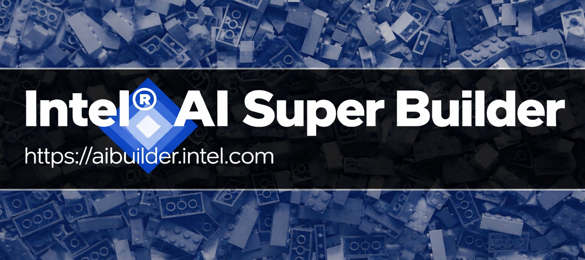
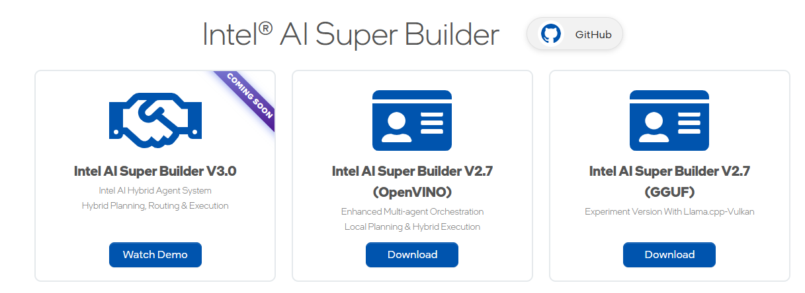

<h1 align="center">Intel® AI Super Builder</h1>

<strong>Intel® AI Super Builder</strong> is Intel’s Gen-AI reference design platform that enables the rapid creation of custom AI assistants and agents tailored to specific industry needs and proprietary data.
These assistants streamline everyday tasks and deliver intelligent solutions by leveraging your internal knowledge bases on Intel®-based AI PCs. Your data and workflows remain private and secure, powered by cutting-edge large language models (LLMs), customizable agentic workflows, and performance-optimized processing.

- [Why Choose Intel® AI Super Builder?](#why-choose-intel-ai-assistant-builder)
- [System Requirements](#system-requirements)
  - [Hardware Requirements](#hardware-requirements)
  - [Software Requirements](#software-requirements)
- [How to Get Started](#how-to-get-started)
- [Developer Resources](#developer-resources)
  - [User Interface Source Code](#user-interface-source-code)
  - [Code Examples and Tutorials](#code-examples-and-tutorials)
  - [API Documentation](#api-documentation)
- [LLM Models and Recommendations](#llm-models-and-recommendations)
- [Platform Capabilities](#platform-capabilities)
- [:bulb: **Coming Soon** :sparkles:](#bulb-coming-soon-sparkles)
- [Help and Troubleshooting](#help-and-troubleshooting)
- [What's New](#whats-new)
  - [Latest Release (Version 2.2.0)](#latest-release-version-220)
  - [Earlier Versions](#earlier-versions)
      - [Version 2.2.0](#version-220)
      - [Version 2.1.0](#version-210)
      - [Version 2.0.0](#version-200)

- [Get Support](#get-support)

 

## Why Choose Intel® AI Super Builder?
- **Simple & Accelerated Development**: Jumpstart local AI inferencing with a rich set of prebuilt **APIs**, reusable **templates**, and a user-friendly tooling environment designed for fast prototyping and deployment.
- **Flexible & Modular Architecture**: Use our turnkey front-end reference design for immediate rollout or integrate only the backend components you need to build a fully customized experience.
- **Secure & Local Execution**: Keep your proprietary data and IP safe with AI that runs directly on-device—no cloud required.
- **Customizable for Any Industry**: Tailor assistants to meet the demands of your specific domain, whether in healthcare, finance, manufacturing, or beyond.
- **Scalable & Portable**: Package and deploy across a wide range of devices and use cases with ease.

 

With Intel® AI Super Builder, you can empower your teams and customers with intelligent, adaptable, and secure AI solutions—delivered simply and on your terms.

 

## System Requirements

The download, installation, and initial setup of the application require an internet connection. Once the initial setup is complete, no connection is needed unless you choose to change the model, in which case additional file downloads may be required.

### Hardware Requirements
  | **Component** | **Minimum Requirements**                                     | **Recommended Requirements**                |
  |---------------|--------------------------------------------------------------|---------------------------------------------|
  | Processor     | Intel® Core™ Ultra processor Series 1 (Meteor Lake)          | Intel® Core™ Ultra 200V series (Lunar Lake) |
  | Memory (RAM)  | 16GB                                                         | 32GB                                        |
  | Storage       | 4GB for 1 LLM                                                | 12GB for 3 LLMs                             |
  | Graphics      | Integrated Intel® Graphics                                   | Integrated Intel® Arc™ Graphics             |
  | Network       | Broadband connection for LLMs and other components’ download |                                             |
> [!NOTE]
>  * Intel® AI Super Builder has been validated on a limited set of Intel AIPC: MTL, LNL, and ARL systems.
> * Minimum Intel Graphics driver version is **30.0.100.9955** and minimum NPU driver version is **32.0.100.4239**.

### Software Requirements
  Intel® AI Super Builder has been validated for use on **Microsoft Windows 11 version 23H2 or newer**. During the installation process, Intel® AI Super Builder application may download and install required components.

> [!TIP]
> To update your Intel® GPU and NPU drivers, please visit [Intel®: Download Drivers & Software](https://www.intel.com/content/www/us/en/download-center/home.html).

## How to Get Started
> [!WARNING]
> Currently, Intel® AI Super Builder supports **one installation at a time**. Please uninstall the existing version before installing a different one.
- ### Download and Install the Software
1. Visit [https://aibuilder.intel.com](https://aibuilder.intel.com/)
2. Click on the download button.
3. Locate and open the downloaded installer. The wizard will guide you through the required steps to successfully complete the installation.

- ### Start Using
Please refer to the [user guide](https://aibuilder.intel.com/Intel%20AI%20Assistant%20Builder%20User%20Guide.pdf) for detailed instructions. See the "Getting Started" section to learn basic usage and the "Special Query Types" section to learn about special workflows.

 

## Developer Resources

### User Interface Source Code
The `src` folder contains our open-source UI components that power the SuperBuilder application interface.

To get started with the UI source code, refer to the [UI development guide](src/superbuilderclient/README.md) for setup instructions and development guidelines.

### Code Examples and Tutorials
  This folder contains a sample application created using the SuperBuilder API service. We included sample projects built from `dotnet`, `Python` and `Go`.

  [Sample Code](example/README.md)

### API Documentation
  Find the API documentation in the following links:

  [API Documentation - Latest](https://intel.github.io/intel-ai-assistant-builder/v2.0.0)

  [API Documentation - v1.2.0](https://intel.github.io/intel-ai-assistant-builder/v1.2.0)

 

## Models and Recommendations

Intel® AI Super Builder now supports OpenVINO and GGUF model formats. Model recommendations are made based on the model format and system hardware, using the performance and accuracy data collected inside our lab.

| **Intel AI Super Builder – OpenVINO**          | **Intel AI Super Builder – GGUF**            |
|------------------------------------------------|----------------------------------------------|
| **Chat models**                                                                                |
| Qwen3-8B-int4-ov                               | Ministral-3-8B-GGUF (**Vision**)             |
| Qwen2.5-7B-Instruct-int4-ov                    | Phi-4-mini-instruct-GGUF-Q4_K_M              |
| Phi-4-mini-instruct-int4-ov                    | gpt-oss-20b-GGUF                             |
| Phi-3.5-vision-instruct-int4-ov                | Qwen2.5-7B-GGUF-Q4_K_M                       |
| DeepSeek-R1-Distill-Qwen-7B-int4-ov            | Qwen3-8B-GGUF-Q4_K_M                         |
| Qwen2.5-VL-7B-Instruct-int4-ov (**Vision**)    | Qwen3-VL-8B-GGUF (**Vision**)                |
| Phi-3.5-mini-instruct-int4-cw-ov-npu (**NPU**) | Ministral-3-14B-GGUF                         |
|                                                | Ministral-3-3B-GGUF                          |
| **RAG models**                                                                                |
| bge-base-en-v1.5-int8-ov                       | bge-base-en-v1.5-GGUF                        |
| bge-reranker-base-int8-ov                      | bge-reranker-base-GGUF-Q8_0                  |

For **Intel AI Super Builder – OpenVINO**, you may also **upload your own model** or **convert models from Hugging Face directly** using the provided "Model Upload" or "Model Conversion" capabilities. Please consult the [user guide](https://aibuilder.intel.com/Intel%20AI%20Assistant%20Builder%20User%20Guide.pdf) for full details on these features.

 

 

## Platform Capabilities
 * **Local LLM and RAG chat**: Build a local knowledge base from your documentation (multiple file formats supported).
 * **Configurable Parameters**: Tune LLM and RAG models, ingestion, retrieval, reranking, and application operations.
 * **Special Query Functions**: Specialized workflows for specific tasks:
   - **Super Agent (MCP)**: Route queries through MCP services with unlimited capability
   - **Analyze Tables**: Process tabular data files
   - **Summarize**: Generate file summaries with follow-up Q&A
   - **Query Image**: Extract text, generate captions, and vision tasks (requires vision model)
   - **Evaluate Resumes**: Score resumes against job descriptions
   - **Score Documents**: Rate documents against custom criteria
 * **Agentic Workflow Examples**: "Super Agent (MCP)" and "Resume Match" demonstrate real-world capability extensions.
 * **Model Management**: Switch, upload, or convert models for latest optimizations.
 * **UI Customization**: Customize interface appearance via Settings.
 * **Profile Management**: Import/export configurations for backup and sharing.
 * **Localization**: Simplified and Traditional Chinese support.
 * **Admin Mode**: Toggle between full admin access and simplified user interface.
 * **API Services**: Access all features through SuperBuilder APIs.

 

## Coming Soon
* **E2E Enterprise Solution**: Connect your Intel AIPC to edge/server clusters for comprehensive enterprise integration.
* **SST and TTS multimodality Features**: Advanced speech synthesis and text-to-speech functionalities for enhanced user interaction and communication.

 

## Help and Troubleshooting
For comprehensive troubleshooting guidance, installation tips, and a complete list of known issues, please refer to the **"Troubleshooting and Known Issues"** section in the [user guide](https://aibuilder.intel.com/Intel%20AI%20Assistant%20Builder%20User%20Guide.pdf).

 

## What's New
### Latest Release (Version 2.7.0)
- Combining domain related versions into a single installer **Intel AI Super Builder - OpenVINO**
- Introducing new experimental support for GGUF models **Intel AI Super Builder - GGUF**
- Introducing MCP Safety through enhanced transparency of MCP Tools

### Earlier Versions
##### Version 2.2.0
- MCP marketplace integration with Modelscope
- Japanese language support
- Wider support for MCP executables

##### Version 2.1.0
- Dark/Light mode sync with Windows Settings
- Enhanced GPU device support
- Knowledge Base compatibility fixes

##### Version 2.0.0

- Introducing MCP Support:
We've added Model Control Protocol (MCP) support, enabling seamless import/export of MCP servers and agents, improved error handling, and enhanced UI/UX for managing workflows. This lays the foundation for more flexible agent-based orchestration and integration with external systems.

- Introducing New OVMS Backend
A new OpenVINO Model Server (OVMS) backend has been integrated into the system. This provides better scalability, cache handling for NPU/GPU models, and improved process management. It ensures more efficient model loading and execution, especially for large-scale workloads.

- Introducing Support for New Models
This release expands compatibility with Qwen3 (now the recommended model), and new NPU model configurations. These additions broaden the model ecosystem and improve flexibility for different use cases.

- New Workflows UI
A Custom Workflows UI has been introduced, providing users with more intuitive control over query flows, agent behaviors, and task automation. Enhancements include reusable components, better active file management, clickable references, and clear visual cues to differentiate current vs. recommended models. The MW and Backend APIs have been updated to improve clarity and simplify integrations.

- Improved Summarization & OOM Handling
Summarization has been significantly upgraded to include more context with multi-level and direct keyword-focused modes.
Overflow token and stop-chat handling fixes have been added to address out-of-memory (OOM) errors.

- Bug Fixes
This release addresses a wide range of issues, including CSV encoding errors, security vulnerabilities and regressions caused by dependency upgrades. These fixes collectively improve reliability and user experience across the platform.

## Get Support
For technical questions and feature requests, please use GitHub [Issues](https://github.com/intel/intel-ai-assistant-builder/issues).

We would love to hear about your experience. Please contact us at [&#115;&#117;&#112;&#112;&#111;&#114;&#116;&#046;&#097;&#105;&#098;&#117;&#105;&#108;&#100;&#101;&#114;&#064;&#105;&#110;&#116;&#101;&#108;&#046;&#099;&#111;&#109;](mailto:support.aibuilder@intel.com).

[Back to Top](#toc)