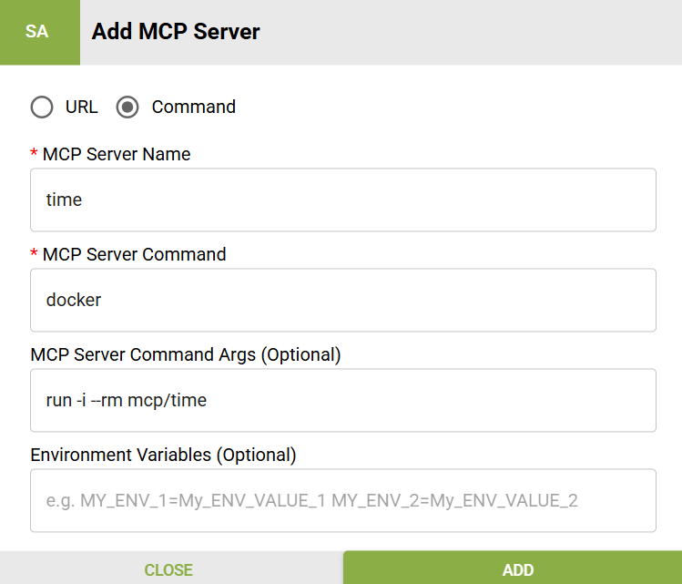

# Open Source MCP Servers

Intel AI Super Builder supports community-maintained MCP servers from the official Model Context Protocol repository at [github.com/modelcontextprotocol/servers](https://github.com/modelcontextprotocol/servers), as well as various MCP marketplaces. These servers provide access to popular tools and services.

For better security and isolation, we recommend using Docker command line when the open source MCP server supports it.

Starting from Intel AI Super Builder v2.2.0, we have integrated the Modelscope MCP marketplace, allowing users to easily explore and try different MCP servers.

Below are four different methods to install and set up open source MCP servers:

## Method 1: Using docker
**Prerequisites:** Docker Desktop must be installed on your system. You can download it from https://www.docker.com/products/docker-desktop/. 

**Note:** 
- Docker login is not required, but download rates are limited without login.
- **Corporate Network Users:** If you're behind a corporate firewall, you may need to manually configure proxy settings in Docker Desktop: Settings > Resources > Proxies. The automatic proxy detection may not work reliably.
- To verify your Docker setup, run the following command in PowerShell or Command Prompt:
  ```bash
  docker pull mcp/time:latest
  ```
  If this command succeeds, your Docker installation is configured correctly.

**Steps:**
1. In the Intel AI Super Builder UI, select **Command** as the connection type
2. Enter the Docker command line in the **MCP Server Command** field (see example below)
3. Configure any required environment variables

See the example configuration below for reference:




## Method 2: Using pip (Python Package Installer)

**Prerequisites:** Python must be installed on your system. We recommend using Python 3.12 or later, which can be downloaded from https://www.python.org/downloads/.

**Steps:**
1. Install the MCP server package via pip (optionally in a virtual environment):
   ```bash
   pip install mcp-server-time
   ```

2. **Important:** Add Python to your **System Environment Variables** (not User Environment Variables):
   - Add the Python installation path to System PATH
   - Example path: `C:\Users\your_user_name\AppData\Local\Programs\Python\Python312\`
   - **Restart your computer** for the system environment change to take effect
   - Or use the full Python path when configuring the MCP server like below


## Method 3: Using uvx (Universal Executor)

**Steps:**
1. Open PowerShell and install uvx:
   ```powershell
   powershell -c "irm https://astral.sh/uv/install.ps1 | iex"
   ```

2. **Important Setup:**
   - The installation will show the uvx.exe download path, for example, `C:\Users\your_user_name\.local\bin`
   - Add the above path to **System Environment Variables** (not User Environment Variables)
   - **Restart your computer** for the system environment change to take effect
   - **Corporate Network Users:** Configure proxy settings (`HTTP_PROXY`, `HTTPS_PROXY`) in System Environment Variables if your network requires proxy authentication for downloading libraries


## Method 4: Using npx (Node Package Executor)

**Prerequisites:** Node.js must be installed

**Steps:**
1. Download and install Node.js from: https://nodejs.org/en/download/current

2. **Important Setup:**
   - Add `C:\Users\your_user_name\AppData\Roaming\npm` to **System Environment PATH**
   - Replace `your_user_name` with your actual Windows username
   - **Restart your computer** for the system environment change to take effect


## Troubleshooting Dependencies

Intel AI Super Builder runs as a Windows Service, which means it uses **System Environment Variables** instead of **User Environment Variables**. If your system is behind a corporate firewall, also add `HTTP_PROXY`, `HTTPS_PROXY`, and `NO_PROXY` to the System Environment.

**To test if Intel AI Super Builder can find your tools:**

1. Open PowerShell and simulate the service environment:
``` Powershell
$env:PATH=[System.Environment]::GetEnvironmentVariable('PATH','Machine')
```

2. Test if the required tools are available:
``` Powershell
Get-Command npx
Get-Command uvx
Get-Command python
Get-Command node
```

3. If any commands fail (even though you have Node.js/Python installed), Intel AI Super Builder won't be able to find them either.

4. **Solution:** Add the installation folders for `npx`, `uvx`, `python`, and `node` to your **System Environment PATH** (not User PATH).

5. Open a new PowerShell window and repeat steps 1-2 to verify the fix.

## Alternative Solution for Connection Closed Errors

If you're still experiencing "connection closed" issues after following the above steps, you can resolve this by using direct command execution with the proper interpreter prefix.

**Solution:** Use the full path to the interpreter when configuring MCP servers instead of relying on PATH resolution.

**For detailed instructions and examples, see:** [Fixing MCP Error 32000 Connection Closed](https://mcpcat.io/guides/fixing-mcp-error-32000-connection-closed/)


## Demo Videos

Explore our comprehensive video demonstrations to see MCP servers in action. All videos are located in the `media\` folder.

### 🕒 Time Zone Agent  
**Features:** Get current time across different time zones worldwide  
**Video:** `media\SuperBuilder_Demo_Time_MCP_Server.mp4`  
**GitHub Link:** [View Video](https://github.com/intel/intel-ai-assistant-builder/blob/main/media/SuperBuilder_Demo_Time_MCP_Server.mp4)

### 🌐 Website Fetch Agent
**Features:** Fetch and process website content using the fetch MCP server  
**Video:** `media\SuperBuilder_Demo_Fetch_Website_MCP_Server.mp4`  
**GitHub Link:** [View Video](https://github.com/intel/intel-ai-assistant-builder/blob/main/media/SuperBuilder_Demo_Fetch_Website_MCP_Server.mp4)

### 📁 File System Agent
**Features:** Access and manage your local file system  
**Video:** `media\SuperBuilder_Demo_File_System_MCP_Server.mp4`  
**GitHub Link:** [View Video](https://github.com/intel/intel-ai-assistant-builder/blob/main/media/SuperBuilder_Demo_File_System_MCP_Server.mp4)
